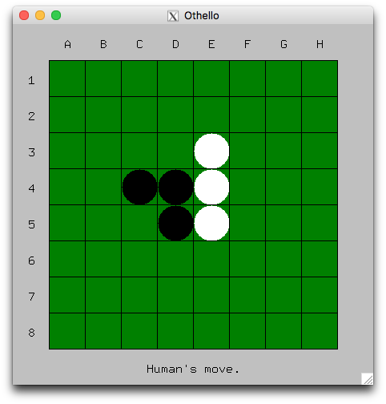

# Reversi-Game
Self-developed AI strategy for Reversi

The AI is built based on Minimax & Alpha-beta algorithm

AI Strategy
-------
(Different strategies are measured and weighted according to chess number placed / fixed standard):

* Flipped decision, which measures the number of opponent's chess to be flipped. (Always highly weighted)

* Availability decision, which measures the available positions can be placed. (Weight dimished gradually)

* last move decision, which measures the last few moves. (Weights increase gradually)

* Corner decision, always highly weighted

* numbers decision, which measures the absolute difference of chess numbers. (Weight increases gradually, and highly weighted in the end)

* Trying to apply simulated annealing now
